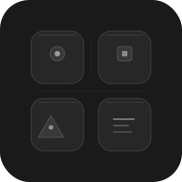

# Apps


Monorepo for standalone apps and experiments. Each subdirectory is an independent project.

## Projects

| App | Description | Platform |
|-----|-------------|----------|
| **bhaddie** | Location-based social + creator economy | Web, iOS, macOS |
| **browser** / **browser-ios** | WebKit web browser | macOS, iOS |
| **cadence** | Git commit progress tracker across all repos | Web, iOS, macOS |
| **claude-usage** / **claude-usage-ios** | Claude token + cost usage tracker | iOS |
| **dashboard-ios** | System dashboard companion | iOS |
| **dose** | Health tracker: drugs, vitamins, biometrics | Web, iOS, watchOS |
| **fuse** | Timepage-style timeline + bomb-timer countdowns | Web, iOS, macOS, watchOS |
| **journal-ios** | Journal companion | iOS |
| **life** / **life-ios** | Conway's Game of Life simulator | macOS, iOS |
| **lingo** / **lingo-ios** / **lingo-macos** | Language learning: 39 subjects, 330+ questions | Web (PWA), iOS, macOS |
| **nimble** / **nimble-ios** / **nimble-web** | Instant answers: DuckDuckGo + Wikipedia + mind-map | macOS, iOS, Web |
| **nyc** / **nyc-ios** / **nyc-web** / **nyc-wallpaper** | Times Square colony survival sim | macOS, iOS, Web |
| **politics** | Political compass explorer | Web |
| **portfolio-ios** | Portfolio companion | iOS |
| **roost** | BC real estate dashboard | Web (PWA) |
| **spark** | Idea-sharing platform with voting | Web, iOS, macOS, watchOS |
| **usage** | Static usage tracking dashboard | Web |
| **wiretext** / **wiretext-ios** / **wiretext-macos** | Unicode wireframe design tool | Web, iOS, macOS |

## Development

SwiftUI apps use xcodegen:

```bash
cd <app-dir>
xcodegen generate
open *.xcodeproj
```

Vite apps:

```bash
cd <app-dir>
npm install
npm run dev
```

Vanilla/static apps:

```bash
cd <app-dir>
python3 -m http.server 8080
```

Requirements: Xcode 16+, xcodegen, iOS 17+ / macOS 14+.
