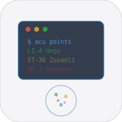

# Acupuncture iOS


Native iOS companion for the acupuncture/reflexology web app. Interactive SVG body maps, 35+ acupuncture points, symptom finder, session tracker.

## Run

```bash
xcodegen generate && open Acupuncture.xcodeproj
```

## License

MIT 2026 Joshua Trommel
