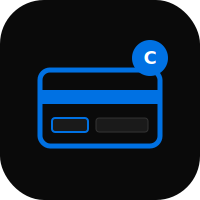

# Compass


PWA wrapper for the Compass card (TransLink BC) website. Add to home screen for a native-like experience with tab navigation, back button, offline error state, and progress indicator.

## Features

- Tab navigation: Home, Reload, Trips, Account
- Back button with history tracking
- Loading progress bar
- Offline detection with retry
- Add to home screen (PWA)
- Dark mode support

## Deploy

```sh
npx vercel --prod
```

## License

MIT 2026, Joshua Trommel
