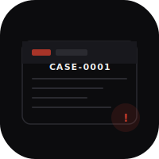

# brief-ios

  

Native iOS litigation planning app for *Trommel v. AG Canada*. SwiftUI port of [heyitsmejosh.com/brief](https://heyitsmejosh.com/brief).

**Case:** Charter violations from warrantless wellness-call entry by Langley RCMP, August 1, 2023. 8 stacked grounds. $800k–$1.5M likely settlement range.

## Features

- Case tab: facts, witness statements with legal annotations, 8 Charter grounds accordion, pain journal (persistent)
- Money tab: outcome scenarios, per-head damage stack, Ward framework, comparable awards
- Actions tab: lawyer contacts with call/email, evidence checklist (persistent), call script + email template with copy/share, timeline, risks, drafts

## Build

```bash
cd apps/brief-ios
xcodegen generate
open Brief.xcodeproj
```

Run on iPhone simulator (iOS 17+).
