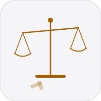

# Brief

  

Litigation planning tool for *Trommel v. AG Canada* (CASE-0001) and *Trommel v. Trommel* (CASE-0002). Private.

**Web:** [heyitsmejosh.com/brief](https://heyitsmejosh.com/brief) (nulljosh.github.io/brief)

---

## Platforms

| Platform | Dir | Stack |
|---|---|---|
| Web | `web/` | Vanilla JS + Supabase JS CDN, PWA |
| iOS | `ios/` | SwiftUI, iOS 17+, Supabase |
| macOS | `macos/` | SwiftUI, macOS 14+, Supabase |

## Features

- Two cases: CASE-0001 (AG Canada) and CASE-0002 (family tort)
- Case tab: grounds, witnesses, facts accordion, journal
- Money tab: damages, scenarios, Ward framework comparables
- Actions tab: lawyers, timeline, checklist, call scripts, risk matrix
- Supabase auth (email + password) with Face ID biometric lock
- Full data sync across platforms via Supabase DB

## Security Roadmap

- [ ] Move Supabase anon key out of source — use `Info.plist` entry on iOS/macOS, env var on web (`web/script.js:3`, `ios/Sources/Models/SupabaseClient.swift:6`, `macos/Sources/Models/SupabaseClient.swift:6`)
- [ ] Remove hardcoded `ALLOWED_EMAIL` (`jatrommel@gmail.com`) from `web/script.js:3` — load from env at deploy time

## Build

```bash
# Web
cd apps/brief/web && python3 -m http.server 8080

# iOS
cd apps/brief/ios && xcodegen generate && open Brief.xcodeproj

# macOS
cd apps/brief/macos && xcodegen generate && open Brief.xcodeproj
```

## License

MIT 2026 Joshua Trommel
