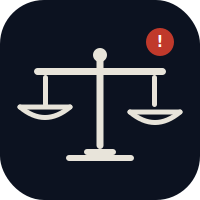

# Brief (macOS)


Native macOS litigation planning tool for *Trommel v. AG Canada*. NavigationSplitView sidebar with Case, Money, and Actions panels. Supabase magic link auth with cross-platform DB sync (journal, checklist, lawyer statuses).

## Stack
SwiftUI · macOS 14+ · Swift 6 · xcodegen

## Build
```bash
cd apps/brief/macos && xcodegen generate && open Brief.xcodeproj
```

## Platforms
- Web: [heyitsmejosh.com/brief](https://heyitsmejosh.com/brief)
- iOS: `apps/brief/ios/`
- macOS: `apps/brief/macos/`
