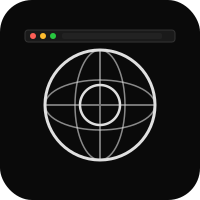

# Browser


Native macOS web browser built on WebKit. No Chromium.

## Features

- Tabs with drag reorder, pinning, suspension, audio indicators, mute
- Content blocker with bundled easylist rules
- Reader mode with font/size/background controls
- Private browsing with ephemeral data store
- HTTPS-only mode with automatic upgrade
- Crash recovery (state saved every 30s)
- Bookmark folders with import/export
- History search, autocomplete, find in page
- Configurable search engine, zoom per-site, print
- Context menus, downloads, keyboard shortcuts

## Build

```bash
xcodegen generate
xcodebuild -scheme Browser -destination 'platform=macOS' build
```

Deploy: `build-dmg.sh` + `notarize.sh`

## Roadmap

- Extension system (v2 stubs in place)
- CloudKit sync (v2 stubs in place)
- Vertical tabs option
- Profile support
- Web Inspector integration

## License

MIT 2026, Joshua Trommel
