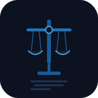

# Charters

 

Constitutional Rights Reference — compare rights and freedoms across 15 constitutions worldwide.

**Live:** [charters.heyitsmejosh.com](https://charters.heyitsmejosh.com) · **Source:** [github.com/nulljosh/apps/tree/main/charters](https://github.com/nulljosh/apps/tree/main/charters)

---

## Features

- Interactive world map — click any highlighted country to browse its constitutional documents
- List view with tag-based category filtering (civil, political, economic, social, cultural)
- **Compare mode** — pick two countries and see their rights side by side
- Global search across 146 articles from 23 documents
- URL hash state — `#CA`, `#compare/CA,US`
- iOS companion app (SwiftUI, iPhone + iPad)

## Countries

Canada, United States, United Kingdom, France, Germany, Japan, Australia, European Union, South Africa, India, Brazil, New Zealand, Mexico, Sweden, South Korea

## Stack

Web: vanilla HTML/CSS/JS, single file, no build step, deployed on Vercel  
iOS: SwiftUI, iOS 17+, universal

## License

MIT 2026 Joshua Trommel
