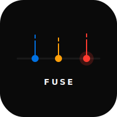

# fuse

Timeline app with bomb-timer countdowns. iCal + custom sources.

## Platforms

- **Web** — React 19 + Vite
- **iOS** — SwiftUI 6.0, iOS 17+, EventKit
- **macOS** — SwiftUI 6.0, macOS 14+
- **watchOS** — Next event + payday countdown

## Features

- Timeline scroll with heat-strip density view
- Live ticking countdowns (days:hours:mins:secs)
- Urgency color shift: blue → orange → red at 72h/24h
- Fuse progress bar depleting as event approaches
- EventKit integration — all iCal calendars
- Tally payday source (BC Income Assistance, last Wednesday of month)
