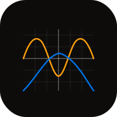

# grapher-ios

  

Native SwiftUI iOS graphing calculator. Mirrors [grapher.heyitsmejosh.com](https://grapher.heyitsmejosh.com).

## Features

- Plot multiple equations simultaneously
- sin, cos, tan, sqrt, log, ln, exp, abs, floor, ceil, x^n
- Pinch-zoom and pan gestures
- Per-equation color + enable/disable toggle
- Persist equations across sessions via UserDefaults
- Export graph as PNG via share sheet
- iPhone: stacked layout (graph top, list bottom)
- iPad: NavigationSplitView sidebar + detail

## Build

```bash
xcodegen generate && open GrapherIOS.xcodeproj
```

## MIT License 2026 Joshua Trommel
