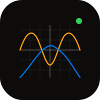

# grapher-macos

  

Native SwiftUI Mac graphing calculator. Mirrors [grapher.heyitsmejosh.com](https://grapher.heyitsmejosh.com).

## Features

- Plot multiple equations simultaneously
- sin, cos, tan, sqrt, log, ln, exp, abs, floor, ceil, x^n
- Scroll-wheel zoom, drag pan
- Keyboard: Cmd+Shift+N add equation, +/- zoom when canvas focused
- Per-equation color + enable/disable toggle
- Persist equations via UserDefaults
- Export graph as PNG via NSSavePanel
- NavigationSplitView: sidebar equations, detail canvas

## Build

```bash
xcodegen generate && open GrapherMac.xcodeproj
```

## MIT License 2026 Joshua Trommel
