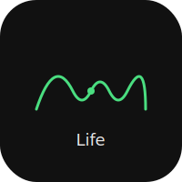
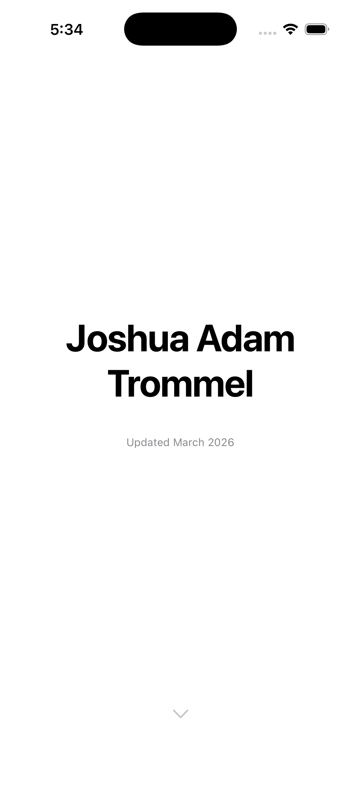

# Josh


Native iOS companion for the [Life](https://github.com/nulljosh/apps/tree/main/life) therapy summary. SwiftUI, iOS 17+, static data, automatic light/dark mode.

## Screenshot



## Features

- Vertical timeline with color-coded categories (crisis, event, forward)
- 20 content sections matching the web version
- System fonts, minimal design
- Print-friendly layout

## Build

```bash
xcodegen generate
open Life.xcodeproj
```
