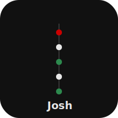

# Joshua Adam Trommel


Personal life summary and timeline for therapy. 20 text sections interleaved with 15 visual elements: charts, pull quotes, a stats dashboard, and a geography map. True 50/50 split between prose and visuals.

## Features

- Dual timeline: horizontal SVG (desktop) + vertical HTML (mobile)
- 10 inline SVG charts: stability, events by phase, aggression, triggers, diagnosis gap, relationships, social circle, housing, coping mechanisms, daily routine
- 3 pull quotes: key sentences isolated for impact
- Key figures stats grid (17 years between diagnoses, 0 friends nearby, etc.)
- Geography map: BC locations + off-map (NYC, Florida, Hawaii)
- Auto light/dark mode
- Scroll fade-up animations (IntersectionObserver)
- Print CSS for PDF export
- Color-coded events: red (crisis), black (event), green (positive)
- Safe area support for notched devices

## View

```bash
open index.html
```

## License

MIT 2026 Joshua Trommel
