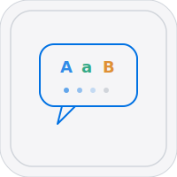

# Lingo


Interactive learning platform -- languages, programming, math, science, and more.

[lingo.heyitsmejosh.com](https://lingo.heyitsmejosh.com)

## Features

- 39 subjects, 330+ questions across 5 categories
- Multiple exercise types: translation, sentence building, typing, math
- XP, daily streaks, lives system
- Dark mode with system preference detection
- Liquid glass UI with animated backgrounds
- Progress persistence via localStorage

## Run

```bash
open index.html
```

## Deploy

Vercel (static).

## Roadmap

- [ ] Spaced repetition algorithm
- [ ] Audio pronunciation
- [ ] User accounts + cloud sync
- [ ] Offline mode (service worker)
- [ ] Leaderboard system

## License

MIT 2026 Joshua Trommel
