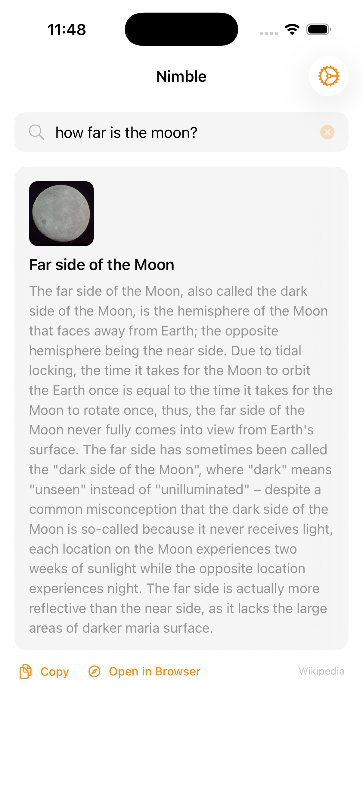

# Nimble iOS


<p align="center"></p>

iOS companion for [Nimble](../nimble/), the instant-answers app. SwiftUI, no API keys required.

## Features

- Live search with 300ms debounce — results appear as you type
- Instant answers: DuckDuckGo + Wikipedia (parallel, 5s timeout)
- Offline math evaluation (trig, sqrt, log, powers, pi, natural language)
- Tap result → full detail view with copy, source link, in-app browsing
- Web results open in SFSafariViewController (stay in app)
- Search history (last 10, persisted to UserDefaults)
- Shimmer loading skeleton
- 8 color themes with haptic feedback

## Development

Requires Xcode and [xcodegen](https://github.com/yonaskolb/XcodeGen).

```bash
xcodegen generate
open NimbleIOS.xcodeproj
```

Target simulator: `iPhone 17 Pro`

## License

MIT 2026 Joshua Trommel
