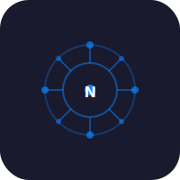

# Nimble Web


Web search engine with radial mind-map visualization. Instant answers and multi-engine web search.

## Features

- Cascading multi-engine search (SearXNG, DuckDuckGo, Brave)
- Radial mind-map result visualization (React Flow)
- Client-side math evaluation (sqrt, sin, cos, tan, log, ln, abs, pow)
- Dark/light theme (auto-detects system preference)
- Rotating placeholder suggestions
- Domain deduplication
- 5s timeout per engine with auto-fallback

## Run

```bash
npm install
npm run dev
```

## License

MIT 2026 Joshua Trommel
