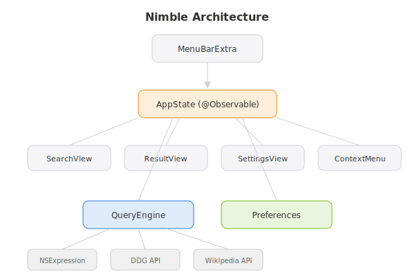

# Nimble


A native macOS app for instant answers. Rebuilt from scratch in SwiftUI, inspired by the original [Nimble](https://github.com/Maybulb/Nimble) by [Maybulb](https://maybulb.com).

## Origins

The original Nimble was a Wolfram|Alpha menubar client built with Electron, created by the Maybulb team circa 2016. It was featured in [The Next Web](http://thenextweb.com/insider/2016/02/08/nimble-brings-wolfram-alpha-to-your-menubar-on-os-x/) and [Lifehacker](http://lifehacker.com/nimble-crams-wolfram-alpha-into-your-macs-menu-bar-1758071364). It was deprecated in June 2020. This is a ground-up rewrite as a native macOS app using SwiftUI, with DuckDuckGo and Wikipedia replacing the Wolfram|Alpha API dependency.

Credit to the original Maybulb developers.

## Features

- Compact window with instant search
- Math evaluation: arithmetic, trig, sqrt, log, powers, pi
- DuckDuckGo Instant Answer API for general queries
- Wikipedia fallback for knowledge lookups
- 8 color themes (orange, red, yellow, green, blue, purple, pink, high contrast)
- Rotating placeholder suggestions
- Copy result text / search link
- No API keys required
- 26 tests passing

> MenuBarExtra (menubar icon) is temporarily disabled due to a macOS Tahoe beta bug. Will re-enable when the SDK stabilizes.

## Development

Requires Xcode and [xcodegen](https://github.com/yonaskolb/XcodeGen).

```bash
xcodegen generate
open Nimble.xcodeproj
```

## Architecture



## Roadmap

### v1.1.0 -- MenuBar & Hotkey
- Re-enable MenuBarExtra when macOS Tahoe SDK stabilizes
- Global hotkey (Cmd+Shift+=) to summon/dismiss
- Search history with arrow key navigation
- Clear history option in settings

### v1.2.0 -- Smart Answers
- Unit conversion (length, weight, temperature, volume)
- Currency conversion via free exchange rate API
- Timezone queries ("time in Tokyo")
- Color preview for hex/rgb values
- Clipboard-aware: auto-fill from clipboard on open

### v1.3.0 -- Integration
- macOS widgets (small: last answer, medium: search bar)
- Shortcuts integration for automation
- Export search history as JSON/CSV

### v2.0.0 -- Multi-Source
- Pluggable answer sources (Wolfram|Alpha, OpenAI, custom)
- Bookmarks/favorites for frequent queries
- Inline web preview for source links
- iCloud sync for preferences and history across macOS/iOS

## License

MIT 2026 Joshua Trommel
