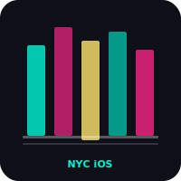

# nyc-ios


iOS companion for Times Square Survival. SpriteKit colony sim with touch input, landscape only.

## Features

- Drag to pan, pinch to zoom camera
- Tap to select colonists, place buildings, long press to demolish
- Bottom toolbar (pause, save, build, demolish)
- RPG stats, XP/leveling, colonist traits
- 3-slot save system with auto-save
- Interactive tutorial adapted for touch

## Run

```bash
xcodegen generate && open TimesSquareSimIOS.xcodeproj
```

Requires Xcode 16+, iOS 17.0+, xcodegen.

## Roadmap

- [ ] Haptic feedback for combat and building
- [ ] iCloud save sync with macOS version
- [ ] Widget for colony status

## Changelog

v0.2.0
- Touch camera controls with pan and pinch
- Colonist interaction flow for select, build, and demolish
- Three-slot save system with auto-save

## License

MIT 2026 Joshua Trommel
