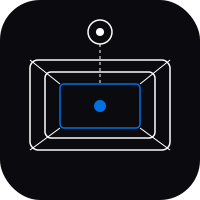
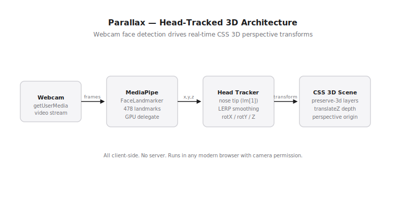

# Parallax

 

Head-tracked 3D parallax for the browser. Your webcam watches your face. As you move your head, the scene shifts perspective in real time — left, right, up, down, closer, further. Pure CSS 3D transforms, no canvas, no backend.

## How it works

MediaPipe FaceLandmarker runs on-device (GPU delegate) and tracks 478 face landmarks at ~30fps. Nose tip position (landmark 1) maps to `rotateX`, `rotateY`, and `translateZ` on a `preserve-3d` scene. LERP smoothing removes jitter.

```
webcam → MediaPipe FaceLandmarker → nose x,y,z → LERP → CSS rotateX/Y + translateZ
```

## Usage

Open `index.html` in any modern browser. Grant camera permission. Move your head.

No build step. No dependencies to install. Ships as a single HTML file.

## Roadmap

- [ ] Scene editor — drag/drop layers, set depth per element
- [ ] Custom background support (image/video)
- [ ] Distance-based auto-zoom calibration
- [ ] Export scene as embeddable snippet
- [ ] Mobile support via front camera

## Architecture



## License

MIT 2026, Joshua Trommel
