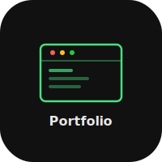

# Portfolio


Native iOS portfolio viewer for [heyitsmejosh.com](https://heyitsmejosh.com). WebView for the full site plus native project cards with tags and links.

## Features

- Native project cards with icon, version, tags, and external links
- Full site WebView tab for browsing heyitsmejosh.com
- Apple Liquid Glass design (ultraThinMaterial cards)
- Segmented picker to switch between native and web views

## Build

```bash
xcodegen generate
open Portfolio.xcodeproj
```

## License

MIT 2026 Joshua Trommel
