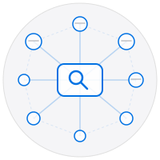
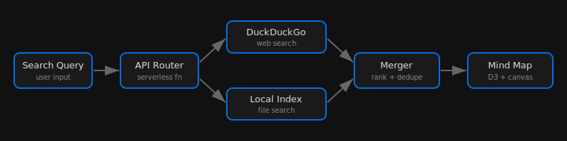

# Rabbit


Search and mind-map visualization tool. Cascading multi-engine search with radial graph layout powered by React Flow.



## Features

- Cascading search: SearXNG (3 instances) -> DuckDuckGo Lite -> Brave Search
- 5s timeout per engine, auto-skip on 429/CAPTCHA
- Radial mind-map layout: 8 results per ring, 300px start radius + 220px per ring
- Domain dedup: max 2 results per domain
- Center search node rendered as React Flow node with fitView maxZoom capped at 1
- Path traversal protection on /api/file/:fileId

## Run

```bash
npm install && npm run dev    # Vite dev server on :5173
npm run build                 # Production build
```

## Changelog

- v2.2.0 - Cascading multi-engine search, radial layout, domain dedup, path traversal protection

## License

MIT 2026 Joshua Trommel
