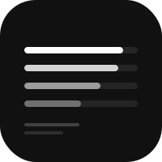

# School


Grade 12 academic tracker. Web dashboard + SwiftUI iOS app. Tracks Pre-Calculus 12 (units 1–7) and Biology 12 / A&P 12 (units 1–9).

Theme follows the device light/dark setting automatically (web + iOS/macOS). Every page and study sheet has a low-ink print button (grayscale, no color).

[Live](https://school.heyitsmejosh.com)

## Subjects

| Subject | Units | Status |
|---------|-------|--------|
| Pre-Calculus 12 | Unit 4 active (class + self-study) | Module tests remaining |
| Biology 12 (A&P) | 9/9 complete, all projects submitted | Done |
| English Studies 12 | — | Done — A · 87% |
| Law 12 | — | Done — C- · 50% |

## Applications

- Capilano University — Paralegal Studies — applying 2026
- UBC Law — after CapU

## iOS App

Three tabs: Grades (live D2L data), Quiz (multiple choice by unit), Plan (applications + unit progress).

## Run

```bash
# Web
python3 -m http.server 8080

# iOS
cd ios && xcodegen generate && open School.xcodeproj
```

## Deploy

```bash
git push origin main   # auto-deploys via Vercel (nulljosh/school)
```

## License

MIT 2026 Joshua Trommel
