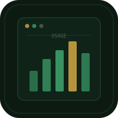

# Usage


AI usage tracker for Claude and ChatGPT. Track conversations, token estimates, and costs across providers with daily, weekly, and monthly breakdowns.

## Features

- Manual logging of AI conversations by provider
- Token and cost estimation tracking
- Daily / weekly / monthly stat aggregation
- Canvas-rendered bar and line charts
- JSON export and import for backup
- PWA-capable, works offline
- Dark Editorial design, mobile-first

## Run

```bash
open index.html
```

Or serve locally:

```bash
python3 -m http.server 8080
```

## Providers

- **Claude** -- Claude Max subscription ($136.60 CAD/mo). Tracks conversations and token estimates. Cost is fixed subscription.
- **ChatGPT** -- ChatGPT Plus or API. Tracks conversations, tokens, and per-use cost estimates.
- **Custom** -- Any other provider. User-defined name and rates.

## License

MIT
